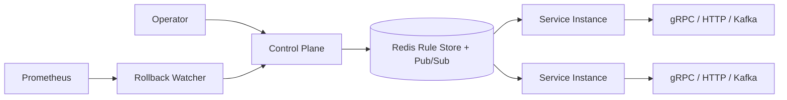

# Faultline

Faultline is a Go library and companion control plane for injecting fine-grained, dynamically activated faults into existing applications. By wrapping gRPC, HTTP, or Kafka handlers with Faultline middleware, faults can be activated, updated, or rolled back live—without redeploying the service.

---

## Why

Infrastructure-layer chaos tools (Chaos Monkey, LitmusChaos, AWS FIS) simulate failures at the VM, container, or network level. They're excellent for validating infrastructure resilience, but they can't express experiments like:

> "Return `UNAVAILABLE` for 30% of `OrderService.Create` requests from a specific client."

Faultline operates one layer lower—at the application boundary—allowing experiments to target individual RPCs, HTTP endpoints, or Kafka consumers with precise matching rules that can be updated dynamically through a control plane.

---

## Architecture



Full architecture notes are available in **docs/architecture.md**.

---

## Demo

After starting the stack you'll be able to observe:

- Live fault injection metrics in Grafana
- Injected span events in Jaeger traces
- Automatic rollback after service error-rate spikes

> *(Recommended: include screenshots of Grafana and Jaeger here once available.)*

---

## Stack

- Go
- gRPC
- Redis (Pub/Sub + storage)
- Kafka (`segmentio/kafka-go`)
- Prometheus
- Grafana
- Jaeger
- OpenTelemetry
- Docker Compose

---

## Repository Layout

```
cmd/                Demo binaries
controlplane/       gRPC control plane + rollback watcher
core/               Rule matching + fault execution
executors/          Fault implementations
interceptors/       gRPC / HTTP / Kafka middleware
ruleengine/         Redis-backed cache + reconciliation
store/              Redis persistence
deploy/             Docker Compose environment
docs/               Architecture notes
```

---

## Running locally

```bash
cd deploy
docker compose up -d --build
```

Services:

| Component | Address |
|-----------|---------|
| Control Plane | localhost:50052 |
| Toy Service | localhost:50051 |
| Metrics | localhost:9090/metrics |
| Grafana | http://localhost:3000 |
| Jaeger | http://localhost:16686 |
| Prometheus | http://localhost:9091 |

---

## Demo

Generate baseline traffic:

```bash
for i in $(seq 1 60); do
  grpcurl -plaintext \
    -d '{"item":"widget","quantity":1}' \
    localhost:50051 \
    order.OrderService/Create >/dev/null
  sleep 0.5
done &
```

Create a latency experiment:

```bash
grpcurl -plaintext \
-d '{
  "rule":{
    "id":"demo-latency",
    "target":{
      "service":"OrderService",
      "method":"Create",
      "client":"*"
    },
    "fault_type":"latency",
    "params":{"latency_ms":300},
    "probability":0.5,
    "active":true
  }
}' \
localhost:50052 \
controlplane.ControlPlane/CreateRule
```

Then observe:

- Grafana → Fault Injections/sec
- Jaeger → `faultline.injected` span event

Trigger automatic rollback:

```bash
grpcurl -plaintext \
-d '{
  "rule":{
    "id":"demo-error",
    "target":{
      "service":"OrderService",
      "method":"Create",
      "client":"*"
    },
    "fault_type":"error",
    "params":{
      "error_code":"UNAVAILABLE"
    },
    "probability":1.0,
    "active":true
  }
}' \
localhost:50052 \
controlplane.ControlPlane/CreateRule
```

Watch the control plane:

```bash
docker compose logs -f controlplaned
```

Expected output:

```
error rate spike detected, rolling back rule
```

---

## Testing

```bash
make test

make redis-up

make test-integration
```

Unit tests cover:

- Rule matcher
- Fault executors
- Redis store
- Rollback watcher
- Interceptors

Integration tests validate Redis Pub/Sub propagation and reconciliation against a real Redis instance.

---

## Design Decisions

### Local rule cache

Requests never contact the control plane. Rules are matched entirely in-memory to avoid adding network latency to application traffic.

### Pub/Sub + reconciliation

Redis Pub/Sub provides low-latency propagation, while periodic reconciliation guarantees eventual consistency if notifications are missed.

### Protocol-independent fault engine

The same matcher and executor logic powers gRPC interceptors, HTTP middleware, and Kafka consumer wrappers. Only protocol-specific wire handling differs.

### Closed-loop rollback

Rollback decisions are based on observed service error rates collected from Prometheus—not Faultline's own injection counters—making rollback responsive to real user impact.

---

## Known Limitations

See **KNOWN_LIMITATIONS.md**.

Most notably, rollback attribution is currently service-wide rather than rule-specific, meaning concurrent experiments on the same endpoint may interfere with each other's rollback decisions.

---

## Future Work

- Rule-scoped rollback attribution
- mTLS authentication
- RBAC
- Structured payload mutation
- Durable experiment persistence
- Web UI for experiment management
- Rule scheduling and expiration
- Canary-scoped experiments

---

## What this project demonstrates

- Building reusable Go middleware libraries
- gRPC interceptor design
- Event-driven cache synchronization
- Distributed systems consistency trade-offs
- Redis Pub/Sub patterns
- Production-oriented observability
- Closed-loop automation using Prometheus metrics
- Thoughtful documentation of engineering trade-offs